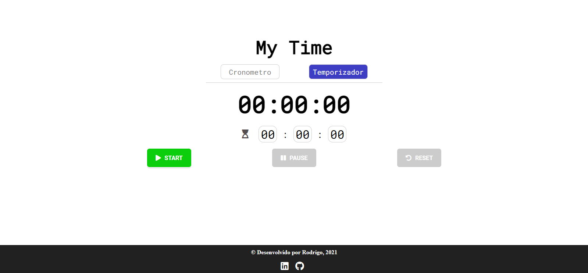
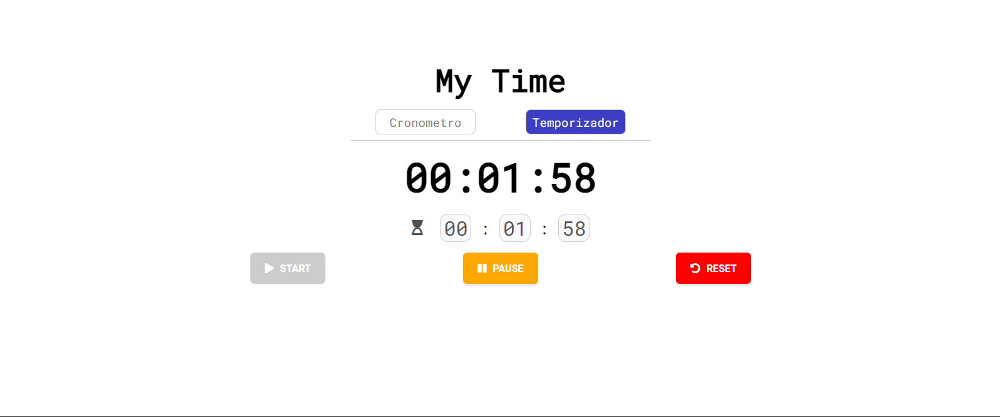
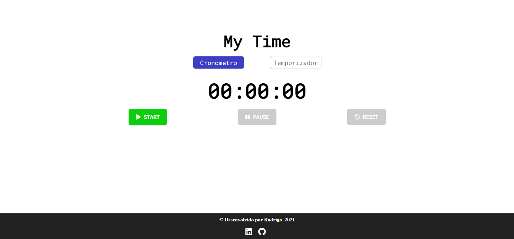
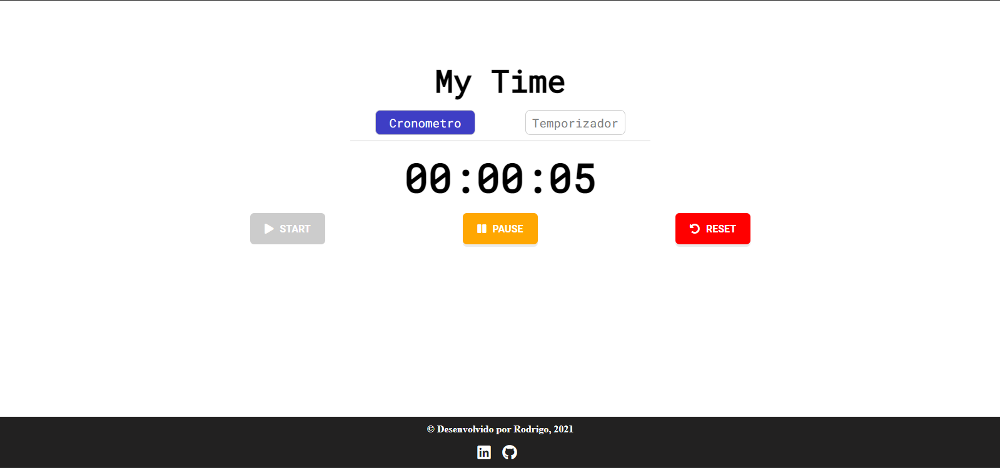

# My Time

<center>


</center>

# Sobre o Projeto:

O projeto é um simples timer, com a possibilidade de usar ele tanto como um cronometro ou temporizador.

Ambos os casos, você tem as opção de: 

- START - pare executar o cronometro ou temporizador.
- PAUSE / RETOMAR - Pausar e retomar do ponto de pausa, no caso ao clicar no botão de pause
a um troca onde o botão de PAUSE se transforma no de RETOMAR.
- RESET - para zerar tanto o cronometro quanto o temporizador

Fiz esse projeto com o intuito de melhor meus conhecimento HTML, CSS, 
JS e Vue.js, principalmente com o uso de Vue.js. 

## Layout Web

## Temporizador



## Temporizador Execução



## Cronometro



## Cronometro em Execução



# Tecnologias utilizadas:

## Front end

- HTML
- CSS
- JS 
- Vue.js

# Por onde começar:

Para começar clone este repositório em um diretório de sua preferência

```bash
# clonar repositório
git clone https://github.com/rodrigoyuri/timer-vuejs.git

# entrar na pasta do projeto
cd seu_repositorio/timer-vuejs
``` 

# Como começar a usar:

## Forma mais simples
Após clonar o repositório você pode entrar nele e dar um duplo click no arquivo index.html.

## Usando VsCode

Caso você utilize o Visual Studio Code, você pode abrir o projeto nele e instalar a extensão chamada Live Server, ao executa-lá ela ira abrir o projeto no seu navegador e caso você faça alguma modificação no projeto automaticamente essa alteração sera refletida em seu navegador devido ao uso da extensão, legal né ? 

# Autor(es)

**Rodrigo Yuri Veloso**

LinkedIn: https://www.linkedin.com/in/rodrigo-yuri/